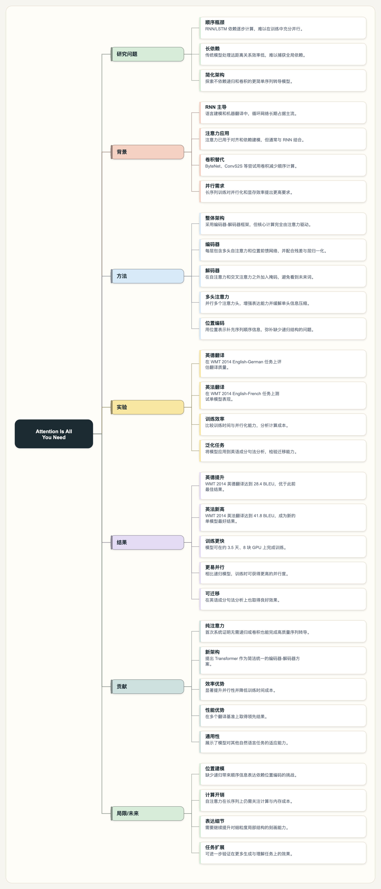
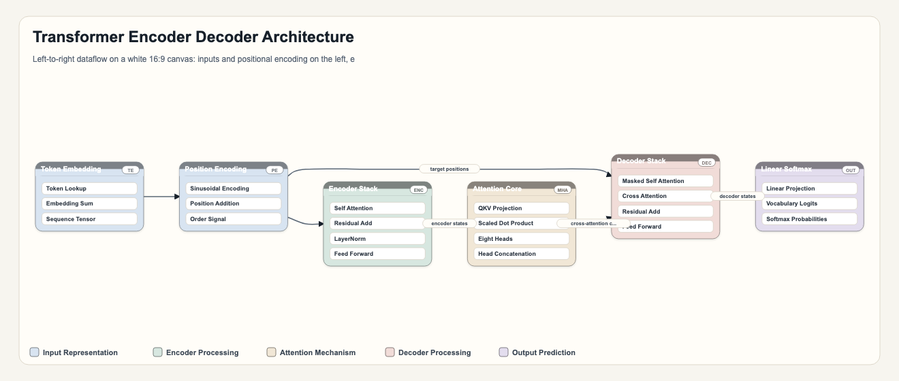

# Paper Figure Studio · 论文配图工作台

面向中文科研场景的论文视觉工作台。把论文 / 研究内容转成**可审查、可编辑、可导出**的视觉材料,而不是简单套模板。

> 📄 项目定位 / 痛点 / 目标用户见 [项目介绍.md](项目介绍.md)；本文档面向使用与部署。开源协议 [MIT](LICENSE)。

---

## 产出示例

| 论文 → 思维导图 | 方法 → 架构图 |
|---|---|
|  |  |

> 以 “Attention Is All You Need” 为输入的实际产出（导图 + 引言架构图，均可导出 PNG/PDF/SVG）。

---

## 功能：三条链路

| 首页 tab | 输入 | 产出 | 引擎 |
|---|---|---|---|
| **读论文：生成导图** | 上传 PDF / 粘贴文本 | ChatPaper2Xmind 风格的右展开**思维导图** | PDF→MinerU/pdfjs，结构→LLM，渲染→SVG |
| **讲项目：生成架构图** | 方法 / 项目描述 | 引言用的**全文架构图**（分层布局、协调配色、可编辑 SVG） | LLM 出结构 + Dagre 分层布局 + SVG |
| **出数据：生成图表代码** | 粘贴数据 / 描述 | 出版级 **seaborn / ggplot2 绘图代码**（本地跑出图） | LLM 生成代码 |

**导出**

- 导图：PNG / PDF / SVG / Markdown / Mermaid / XMind
- 架构图：SVG / PNG / PDF（可直接插入论文）
- 图表：可复制 / 下载的 `.py`（seaborn）或 `.R`（ggplot2）代码，并保存图表历史用于继续编辑

> 「AI 配图（图片模型出插画风图）」后端已就绪但 UI 默认关闭，启用方法见 [如何接入 AI 配图](#如何接入-ai-配图可选)。

---

## 快速开始

先装 [Node.js](https://nodejs.org) 18+（Windows 直接下安装包,一路下一步）。

### macOS / Linux
```bash
npm install                  # 1. 安装依赖（首次）
cp .env.example .env.local   # 2. 复制配置，然后编辑 .env.local 填 key
npm run dev                  # 3. 启动 → http://localhost:3000，停止按 Ctrl+C

npm run build && npm run start   # 生产构建 / 启动
npm run typecheck                # 类型检查
npm test                         # 渲染器单元测试（导图/架构图/图表/转义/消毒）
npm run quality:golden           # 三个真实场景的端到端质量校验
```

### Windows（PowerShell）
```powershell
npm install                        # 1. 安装依赖（首次）
Copy-Item .env.example .env.local  # 2. 复制配置，然后编辑 .env.local 填 key（cmd 用 copy .env.example .env.local）
npm run dev                        # 3. 启动 → http://localhost:3000，停止按 Ctrl+C

npm run build ; npm run start      # 生产构建 / 启动
npm run typecheck                  # 类型检查
```

> 命令唯一区别:复制文件 Windows 用 `Copy-Item`（mac 用 `cp`）。`npm` 命令完全一致,依赖(sharp/pdfjs 等)都有 Windows 预编译版,`npm install` 自动装好。

---

## 环境变量（`.env.local`）

### 1. 文本规划（必填，驱动全部三条链路）

```bash
LLM_PROVIDER=gateway                 # gateway | openai | gemini | openrouter | cloudflare | custom | mock
GATEWAY_BASE_URL=https://你的网关     # OpenAI 兼容网关（代码会自动补 /v1）
GATEWAY_API_KEY=sk-xxx
GATEWAY_TEXT_MODEL=gpt-5.5
# LLM_TIMEOUT_MS=90000               # 出图较慢，默认 90s，勿调太小（太小会退回模板）
```

也支持其它文本 provider：

- `LLM_PROVIDER=openai`：`OPENAI_API_KEY` / `OPENAI_TEXT_MODEL`
- `LLM_PROVIDER=gemini`：`GEMINI_API_KEY` / `GEMINI_TEXT_MODEL`
- `LLM_PROVIDER=openrouter`：`OPENROUTER_API_KEY` / `OPENROUTER_TEXT_MODEL`
- `LLM_PROVIDER=cloudflare`：`CLOUDFLARE_API_KEY` / `CLOUDFLARE_ACCOUNT_ID` / `CLOUDFLARE_TEXT_MODEL`
- `LLM_PROVIDER=custom`：任意 OpenAI 兼容接口 `CUSTOM_LLM_BASE_URL` / `CUSTOM_LLM_API_KEY` / `CUSTOM_LLM_TEXT_MODEL`

#### 💡 没有网关？用公共模型（复制即用）

**首选:智谱 GLM-4-Flash —— 国内、免费、无需绑卡**（去 https://bigmodel.cn 拿 key）:
```bash
LLM_PROVIDER=custom
CUSTOM_LLM_BASE_URL=https://open.bigmodel.cn/api/paas/v4/chat/completions
CUSTOM_LLM_API_KEY=你的智谱key
CUSTOM_LLM_TEXT_MODEL=glm-4-flash
CUSTOM_LLM_WIRE_API=chat
```

**阿里云百炼 Qwen（国内）** —— 用 OpenAI 兼容地址(key 同配图那个 `sk-`):
```bash
LLM_PROVIDER=custom
CUSTOM_LLM_BASE_URL=https://dashscope.aliyuncs.com/compatible-mode/v1
CUSTOM_LLM_API_KEY=sk-你的百炼key
CUSTOM_LLM_TEXT_MODEL=qwen-plus
CUSTOM_LLM_WIRE_API=chat
```

**国际可直连**:
```bash
# OpenRouter（一个 key 调多家，有免费模型）
LLM_PROVIDER=openrouter
OPENROUTER_API_KEY=你的key
OPENROUTER_TEXT_MODEL=google/gemini-2.0-flash-exp:free

# 或 OpenAI 官方
LLM_PROVIDER=openai
OPENAI_API_KEY=sk-你的key
OPENAI_TEXT_MODEL=gpt-4o-mini
```

> 选**任意一个**填好即可,三条链路都用同一个文本模型。国内推荐智谱 GLM-4-Flash(免费够用)。

### 2. PDF 解析（可选；不配则用本地 pdfjs 兜底）

```bash
# MinerU 云 API：中文+学术最准，免费 2000 页/天
# Token 在 https://mineru.net/apiManage 申请（eyJ 开头的长 JWT，14 天有效）
MINERU_API_KEY=eyJ...
# MINERU_ENDPOINT=https://mineru.net   # 私有化部署填 http://你的IP:端口
```

不填 `MINERU_API_KEY` 时，上传 PDF 自动走**本地 pdfjs**（零配置、离线、免费；单栏/摘要够用，复杂双栏/公式建议配 MinerU）。

### key 在哪申请（速查）

| 用途 | 变量 | 申请地址 |
|---|---|---|
| OpenAI 兼容网关（推荐） | `GATEWAY_API_KEY` | 找提供网关的人要（学校/公司/自建） |
| OpenAI 官方 | `OPENAI_API_KEY` | https://platform.openai.com/api-keys |
| Google Gemini | `GEMINI_API_KEY` | https://aistudio.google.com/apikey |
| OpenRouter（多家合一） | `OPENROUTER_API_KEY` | https://openrouter.ai/keys |
| Cloudflare Workers AI | `CLOUDFLARE_API_KEY` / `_ACCOUNT_ID` | https://dash.cloudflare.com |
| **MinerU**（PDF 解析，免费） | `MINERU_API_KEY` | https://mineru.net/apiManage |
| **阿里云百炼 Qwen**（配图） | `DASHSCOPE_API_KEY` | https://bailian.console.aliyun.com → API-KEY |
| 智谱 CogView（配图，免费） | `CUSTOM_IMAGE_API_KEY` | https://bigmodel.cn → API Keys |
| Replicate（配图） | `REPLICATE_API_TOKEN` | https://replicate.com/account/api-tokens |
| Stability（配图） | `STABILITY_API_KEY` | https://platform.stability.ai/account/keys |

> 每个变量旁边在 `.env.example` 里也有对应注释和地址。**只需配你实际要用的那几个**（最少:一个文本 provider 即可跑导图/架构图/图表）。

---

## 推荐 API 一览

### 文本模型（驱动三条链路，选一个）

| 模型 | 在本项目怎么用 | key / 渠道 | 备注 |
|---|---|---|---|
| **OpenAI GPT**（gpt-4o / 4.1 …） | `LLM_PROVIDER=openai` | platform.openai.com | 综合强,按量付费 |
| **Claude**（Anthropic） | `LLM_PROVIDER=openrouter` 用 `anthropic/claude-*`；或 `custom` 填 Anthropic 的 OpenAI 兼容地址 `https://api.anthropic.com/v1/chat/completions` | console.anthropic.com / openrouter | 原生非 OpenAI 格式,走兼容层或 OpenRouter 最省事 |
| **Google Gemini** | `LLM_PROVIDER=gemini` | aistudio.google.com | 国内需可访问 Google |
| **智谱 GLM-4-Flash** ⭐ | `LLM_PROVIDER=custom` | bigmodel.cn | **国内免费首选**,无需绑卡 |
| **阿里 Qwen**（qwen-plus/turbo） | `LLM_PROVIDER=custom`（compatible-mode） | 百炼 | 国内,便宜 |
| **DeepSeek** | `LLM_PROVIDER=custom` `https://api.deepseek.com` | platform.deepseek.com | 便宜,OpenAI 兼容 |
| **OpenRouter**（一个 key 调几乎所有，含 GPT/Claude/Gemini） | `LLM_PROVIDER=openrouter` | openrouter.ai | 想随便切模型用它最方便 |

### 文生图模型（AI 配图用，可选）

> 论文配图的关键是**图里文字标签准不准**。下表「文字」一列就是这个能力。

| 模型 | 在本项目怎么用 | key / 渠道 | 文字标签 | 备注 |
|---|---|---|---|---|
| **Nano Banana**（Gemini 2.5/3 Flash Image） | `IMAGE_PROVIDER=gemini`；国内可走 `openrouter`（`google/gemini-2.5-flash-image`）或中转 `custom-image` | aistudio / openrouter / 中转站 | ✅ 强 | 综合最强,示例图那种质感多是它 |
| **Qwen-Image**（阿里） | `IMAGE_PROVIDER=qwen` | 百炼 | ✅ 中文最强 | 国内首选,需模型广场开通 |
| **OpenAI gpt-image-1** | `IMAGE_PROVIDER=openai` | platform.openai.com | ✅ 较好 | |
| **Recraft V3 / Ideogram** | `IMAGE_PROVIDER=replicate`（`recraft-ai/...` / `ideogram-ai/...`） | replicate.com | ✅ 强 | 图片模型里**矢量/信息图/文字最好** |
| **智谱 CogView** | `IMAGE_PROVIDER=custom-image` | bigmodel.cn | ⚠️ 弱 | 免费免绑卡 |
| **FLUX** | `IMAGE_PROVIDER=replicate`（`black-forest-labs/flux-*`）或 `pollinations` | replicate / 免 key | ⚠️ 弱 | 质量好但文字差 |
| **Seedream / 即梦**（字节） | `IMAGE_PROVIDER=custom-image`（火山方舟 OpenAI 兼容）或 replicate | 火山方舟 | ⚠️ 中 | 美学强,长文本弱 |
| **Stability**（SD 3.5） | `IMAGE_PROVIDER=stability` | platform.stability.ai | ⚠️ 弱 | |
| **Midjourney** | ⚠️ **无官方 API**,只能 Discord 或第三方中转;若中转提供 OpenAI `/images` 兼容→`custom-image` | 中转站 | ❌ 差 | 美学天花板,但文字差 + 无官方 API,**不适合带标签的论文图** |

**选型结论(给论文配图)**：要「好看 + 标签清晰」→ 选 **Nano Banana / Recraft / Ideogram / gpt-image / Qwen(中文)**,或用 **Hybrid**（模型出无字底图 + SVG 叠标签）。**Midjourney/FLUX/CogView 文字不准,只适合不在乎标签的纯插画。**

---

## 如何接入 AI 配图（可选）

> 用图片大模型把架构图渲染成「插画风」配图。**后端已经写好**（`/api/generate-image` + 图片 provider 注册表 `lib/providers/imageProviders.ts`），但前端入口默认移除了，需要按下面三步接回。

### 第一步：配置图片 provider（`.env.local`）

```bash
IMAGE_PROVIDER=qwen   # qwen | custom-image | gemini | openai | openrouter | replicate | stability | pollinations | mock
```

按所选 provider 填对应 key：

| provider | 变量 | 说明 |
|---|---|---|
| `qwen`（阿里云百炼，国内、中文标签强） | `DASHSCOPE_API_KEY`、`QWEN_IMAGE_MODEL`、`QWEN_BASE_URL` | 同步模型 `qwen-image-2.0`/`-pro`/`-max`；异步 `qwen-image`/`-plus`/`wanx*`（代码按模型名自动选同步/异步端点）。**需在百炼「模型广场」开通该模型的 API 权限,否则报 `Model.AccessDenied`**。北京地域用 `https://dashscope.aliyuncs.com`，新加坡用 `https://dashscope-intl.aliyuncs.com` |
| `custom-image`（如智谱 CogView，免费免绑卡） | `CUSTOM_IMAGE_BASE_URL`、`CUSTOM_IMAGE_API_KEY`、`CUSTOM_IMAGE_MODEL`、`CUSTOM_IMAGE_MODE`、`CUSTOM_IMAGE_SIZE` | 任意 OpenAI 兼容 `/images/generations` 接口,**纯填 env 即可,无需写代码** |
| `pollinations` | 无 | 免 key 免费,文字弱 |
| `gemini` / `openai` / `openrouter` / `replicate` / `stability` | 各自的 `*_API_KEY` / `*_IMAGE_MODEL` | 见 `.env.example` |

### 第二步：后端已就绪,直接调用

```
POST /api/generate-image
{
  "projectId": "...",          // 来自 /api/analyze 返回
  "prompt": "...",             // 用架构方案的 prompt
  "negativePrompt": "...",
  "aspectRatio": "16:9",
  "mode": "standard"           // "standard"=纯模型直出 | "hybrid"=AI 出无字底图 + SVG 叠清晰标签
}
```

返回 `{ status, imageUrl, baseImageUrl?, model, message }`。

### 第三步：前端加回入口（在架构图页）

在 `app/components/StudioClient.tsx` 的「讲项目」区,给 `draftPlan` 加一个按钮：`fetch("/api/generate-image", {...})` → 把返回的 `imageUrl` 用 `` 展示。（历史实现可在 git 记录里参考 `generateCloudImage`。）

### 选型建议（重要）

- **架构图要标签精确 → 不要用图片模型**,用本工具自带的 SVG（标签 100% 正确）。
- 图片模型适合「插画 / 示意」质感,但**扩散模型画不准密集英文标签**。
- 想要示例那种「好看 + 标签清晰」：要么用**文字渲染强的模型**（nano-banana / gpt-image，国内多需中转）；要么用 **`mode: "hybrid"`**（模型只画无字底图,清晰标签由 SVG 叠加）。

---

## 数据图表代码运行依赖

```bash
# Python（seaborn）—— 也可用项目根的 requirements.txt
pip install -r requirements.txt          # 等价于 pip install seaborn matplotlib pandas numpy

# R（ggplot2）
Rscript -e 'install.packages("tidyverse")'
```

> `requirements.txt` 只服务于「数据图表」生成的 Python 代码；**Web 应用本身用 Node（`package.json`），不需要 Python**。

生成的代码自带出版级样式（图例外置、比例均衡、300dpi、同时导出 PNG + 矢量 PDF），本地直接运行即可。

### Python / R 图表覆盖范围

图表 tab 不是只做柱状图，而是内置了科研常见图谱，按类别筛选：

- **实验对比**：柱状图、分组/堆叠柱状图、棒棒糖图、斜率图、哑铃图。
- **统计分布**：直方图、密度图、箱线图、小提琴图、雨云图、山峦图、ECDF。
- **关系/相关**：散点图、气泡图、回归散点、Hexbin、联合分布、变量成对关系。
- **趋势/时间序列**：折线图、面积图、置信带折线、控制图、日历热力图。
- **矩阵/热力**：热力图、聚类热力图、相关矩阵、混淆矩阵。
- **组成/流向**：环形图、饼图、矩形树图、旭日图、桑基图、冲积图、雷达图。
- **模型评估**：ROC、PR 曲线、校准曲线、Lift/Gain、学习曲线、残差图、Q-Q 图、特征重要性、SHAP、部分依赖。
- **统计推断**：误差棒、森林图、Kaplan-Meier 生存曲线、Bland-Altman、显著性标注图。
- **生信/组学**：火山图、Manhattan 图、PCA、UMAP/t-SNE、富集气泡图。
- **空间/场**：分区地图、空间散点、等高线图。

网页预览是安全的轻量 SVG 预览，不执行用户 Python/R；最终发表图以生成代码本地运行出的 PNG/PDF 为准。

没有 LLM key 时也会返回可运行模板：常见的 ROC / PR、混淆矩阵、森林图、火山图、特征重要性、训练曲线等都有专门 fallback，不会全部退化成普通柱状图。

生成代码后会自动做一次**代码质量检查**：确认是否同时保存 PNG/PDF、是否设置 300dpi、图例是否遮挡、是否仍有 TODO 占位、图表类型是否适合论文，以及评估/推断图是否标明阈值或参考线。

---

## 设计要点

- **证据优先**：先从论文抽取真实方法 / 模块 / 结果,再画图,避免空泛占位。
- **小白可用**：科研图和数据图表都提供场景 Preset,并用规则引擎自动推荐图类型 / 图表类型；用户不需要先懂“机制图、Graphical Abstract、热力图、分组柱状图”这些术语。
- **审慎科研表达**：科研图会提示缺少的数据来源、评价指标、限制条件；搜索推荐、图像处理、统计建模等场景会给出“不建议画什么”的风险提醒，避免把预测图画成因果图。
- **架构图坚持矢量**：标签必须 100% 正确,所以用 SVG + Dagre 分层布局（自动处理分支、反馈回环、避免连线交叉），而非图片模型。
- **配色统一**：`lib/palettes.ts` 内置多套协调配色（paper-pro / 暖 / 冷 / Okabe-Ito / Nature / IEEE / 灰度 …），加一条即新增一套。
- **数据图表用代码**：数据图必须按真实数据画（图片模型会编造数值），借鉴 nature-figure 生成 seaborn/ggplot2 出版级代码；内置实验对比、统计分布、模型评估、统计推断、生信组学、空间场等科研图谱。
- **可插拔**：换文本 / 图片 provider 只改 env；加图片后端只在 `IMAGE_PROVIDERS` 注册表加一条；加图表类型只在 `lib/chart/chartTypes.ts` 加一条；加配色只在 `lib/palettes.ts` 加一条。
- **稳健性**：SVG 注入前先消毒（`lib/infra/sanitizeSvg.ts`）；本地存储串行化 + 原子写，损坏的 JSON 自动备份而非静默清空；PDF 限大小/页数，MinerU 轮询对齐 60s 函数上限；API 路由按 IP 轻量限速；LLM 失败时退回本地模板并以醒目警告告知用户。

## 设计亮点（Design Highlights）

- 不是“调一个生图 API”，而是把科研视觉拆成三条确定链路：论文结构化、研究方法可视化、真实数据图表代码生成。
- 科研图使用 `FigureSpec` 作为中间层，把 panels / objects / arrows / evidenceMapping / critic 分开，方便审查和二次编辑。
- 对新手做了产品化决策：根据输入内容自动推荐图类型和图表类型，同时指出缺少证据和不建议夸大的地方。
- 对机器学习 / 搜索推荐 / 图像处理场景做了专用 render,不是所有内容都套同一个流程图模板。
- 图片模型只作为可选增强；核心论文图优先 SVG 和代码,保证标签、数值、证据可控。

---

## 项目结构

> 三条链路(mindmap / figure / chart)是核心心智模型,**前端和后端逻辑都按这三组分文件夹**,顺着名字找即可。

```
app/
  page.tsx layout.tsx globals.css
  api/                       # 后端路由（Next Route Handlers），按链路命名
    analyze/  mindmap/  chart/         # 三条链路各自的生成入口
    render-svg/  optimize-plan/         # 架构图重绘 / 评审优化
    generate-image/                     # AI 配图后端（UI 默认关闭）
    projects/  chart-projects/          # 本地历史
    config/  references/  …             # provider 状态、参考图库
  components/                # 前端（"use client"），按链路分组
    StudioClient.tsx         #   主壳：三个 mode 切换
    ui.tsx                   #   共享 UI 基础组件（Panel/Field/Notice…）
    mindmap/                 #   读论文 → 导图
    figure/                  #   讲项目 → 架构图（Workspace + 面板 + 拖拽编辑 + hooks）
    chart/                   #   出数据 → 图表代码（Workspace + 预览 + 代码评审）
lib/                         # 与框架无关的核心逻辑，同样按链路分组
  types.ts  utils.ts  palettes.ts       # 全局共享：类型 / 工具 / 配色
  mindmap/                   #   mindmapGenerator.ts（结构 + 右展开大纲树 SVG）
  figure/                    #   架构图链路
    paperAnalyzer.ts         #     论文分析编排
    figureSpec.ts            #     FigureSpec 中间层（panels/objects/arrows/evidence/critic）
    figureRenderer.ts        #     FigureSpec → SVG
    referenceGallery.ts      #     参考图库
    spec/  renderers/        #     结构/Prompt 构建 + Dagre 分层渲染
  chart/                     #   chartGenerator / chartTypes / chartCritic
  parsers/mineru.ts          #   PDF 解析（MinerU 云 API + 本地 pdfjs 兜底）
  providers/                 #   llmProviders（文本多路由）/ imageProviders（图片注册表）
  infra/                     #   底层设施：storage（串行化+原子写）/ rateLimit / sanitizeSvg / exportUtils
scripts/                     # 质量校验（零依赖，现编译 TS 运行）
  render-tests.{ts,mjs}      #   npm test：渲染器 / 转义 / 消毒单元校验
  golden-quality.{ts,mjs}    #   npm run quality:golden：三个真实场景端到端校验
test/                        # 测试论文 + 效果展示截图（不参与构建）
data/                        # 本地运行时数据（.gitignore）
```

---

## 技术栈

Next.js 15 (App Router) · React 19 · TypeScript · Tailwind · Dagre（图布局）· fflate（解压 MinerU 结果）· pdfjs-dist（本地 PDF 解析）。运行时数据存本地 `data/projects.json`。

---

## 注意

- LLM 网关 OpenAI 兼容地址需带 `/v1`（代码自动补全）。
- MinerU Token 14 天到期；其返回的结果链接 24 小时有效,尽快下载。
- 图片模型（如 Qwen-Image）返回的多为临时链接（约 24h），出图后请尽快保存。
- `.env.local` 含真实密钥，已被 `.gitignore` 忽略，请勿外传。

---

## 部署上线（可选）

本项目是 **Next.js 全栈应用**(不是 Python，**不能托管到 Streamlit / GitHub Pages**)。最省事的是 **Vercel**(Next.js 官方平台，连 GitHub 自动部署，免费档够用)。

### 部署到 Vercel

1. 先把仓库推到 GitHub(见上文)。
2. 打开 https://vercel.com → 用 GitHub 登录 → **Add New → Project** → 选这个仓库 → Import。
3. 在 **Settings → Environment Variables** 里填 key(就是你 `.env.local` 里的那几个，如 `LLM_PROVIDER`、`GATEWAY_*` 或 `CUSTOM_LLM_*`、`MINERU_API_KEY` …)。**key 填这里，不进仓库。**
4. Deploy，几十秒后给你一个 `https://xxx.vercel.app` 网址，之后每次 `git push` 自动重新部署。

> 其它选择:Netlify / Cloudflare Pages(同为 Next.js 友好)；想要文件持久化用 Railway / Render；或自己服务器 `npm run build && npm run start`。

### ⚠️ 上云前要知道的两个坑

- **本地文件存储会丢**:历史项目存在 `data/projects.json` 和 `data/chart-projects.json`(写本地文件)，而 Vercel 等 serverless 的文件系统是**临时的**——当场生成当场看没问题，但刷新后历史项目可能不在。要真正持久化,需把存储换成数据库/KV(如 Vercel KV、Supabase)。
- **超长 LLM 调用可能超时**:架构图的 LLM 出图约 1 分钟，而免费档函数有执行时长上限。本仓库已带 [`vercel.json`](./vercel.json) 把 `maxDuration` 提到 60s;若仍超时,改用更快的文本模型或把 `LLM_TIMEOUT_MS` 调小。

---

## 后续方向（Roadmap）

- **AI 配图启用**：按上文「如何接入 AI 配图」接回 UI；要达到示例级「插画 + 清晰标签」建议用文字渲染强的模型或 Hybrid 方案。
- **群聊 / 对话解析**：粘贴群聊记录 → 清洗 → 生成纪要 / 导图 / 待办（复用现成导图渲染器）。
- **全文总览图类型**：让 LLM 按「问题 → 数据 → 方法 → 实验 → 贡献」出整篇框架,更贴「引言总览图」。
- **生成体验**：架构图 LLM 出图较慢（~1 分钟），可做「先秒出本地草图、LLM 回来再替换」。
